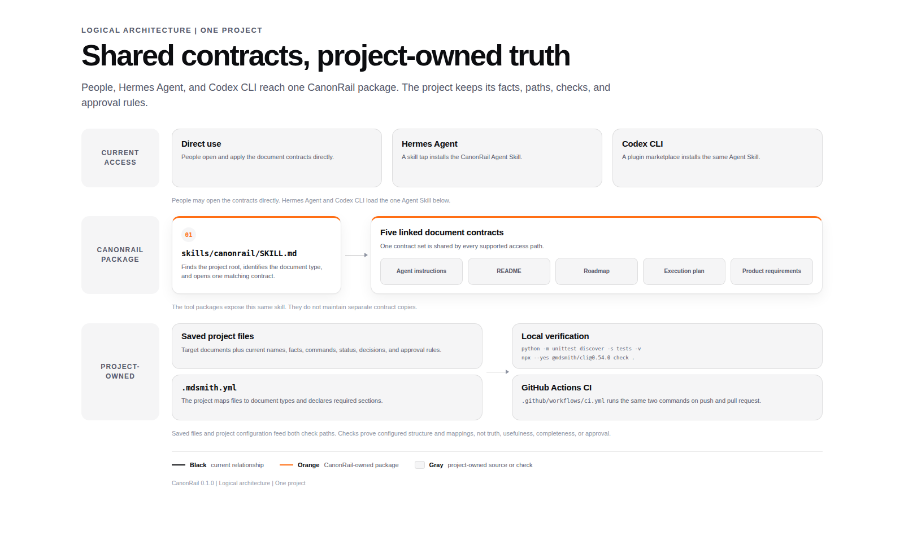

# Architecture



[Open the full-size HTML diagram](architecture.html).

This is a logical view of CanonRail in one project. It shows the current direct, Hermes Agent, and Codex CLI paths.

## Responsibilities

| Responsibility                                                       | Owner                                                             |
| -------------------------------------------------------------------- | ----------------------------------------------------------------- |
| Choose the target document and supply current project facts          | The project and its maintainers                                   |
| Identify the document type and open the matching contract            | CanonRail Agent Skill, or the person using the contracts directly |
| State what belongs in each supported document                        | CanonRail document contracts                                      |
| Define names, commands, paths, status, decisions, and approval rules | The project                                                       |
| Check required sections and file-to-document mappings                | The project's configured check                                    |
| Expose the same Agent Skill to a compatible tool                     | Hermes Agent skill tap and Codex CLI marketplace packages         |

## Supported paths

People can read the contracts directly. Hermes Agent and Codex CLI install the same Agent Skill and its five linked contracts. Their package manifests do not define separate document rules.

Claude Code is not part of the current supported path.

## Verification paths

Local verification and `.github/workflows/ci.yml` run the same commands:

```bash
python -m unittest discover -s tests -v
npx --yes @mdsmith/cli@0.54.0 check .
```

The Python suite checks package, contract, fixture, and public-writing relationships. mdsmith checks required sections and file-to-document mappings.

## Boundary

- CanonRail defines reusable document contracts and the procedure for applying them.
- The project keeps authority over its facts, files, exceptions, checks, and approvals.
- A configured check can verify declared structure. It cannot prove that the writing is true, useful, complete, or approved.
- CanonRail does not install or configure a checker unless the user requests that setup.
